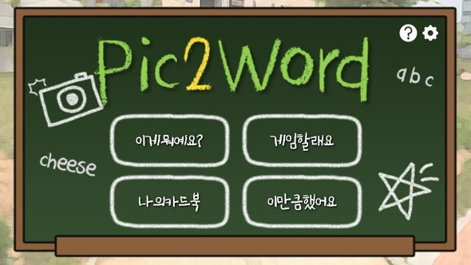
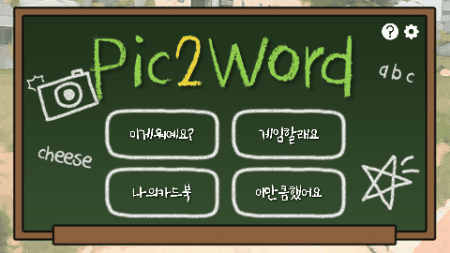
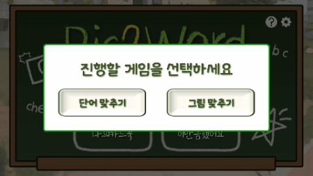
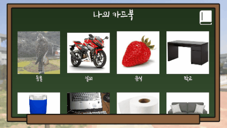
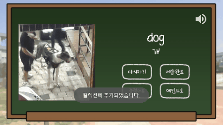
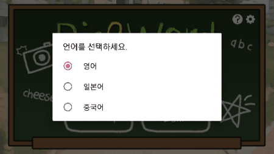

# Pic2Word

 

 

시연영상 : https://youtu.be/LJ9Xgg2PLbs

 

- Main
  - 
- Function
  - Recognition : Recognize an object in a picture and learn a word  
  

  - Game : Game learning with various difficulty levels  
  

  - Card book : Your own cardbook to study with your own photos  
  

  - Collection : Photo Collection Record  
  

  - Multilingual : Learning English as well as Japanese and Chinese  
  
- Collaborator
  - Android App : 원지연, 이주혜
  - Design : 이주혜
  - Server(Node.js) : 고수현
  - Image recognition module(Python, tensorflow) : 고수현
